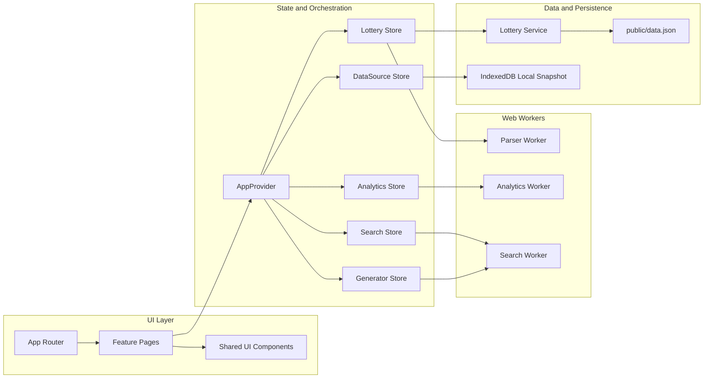
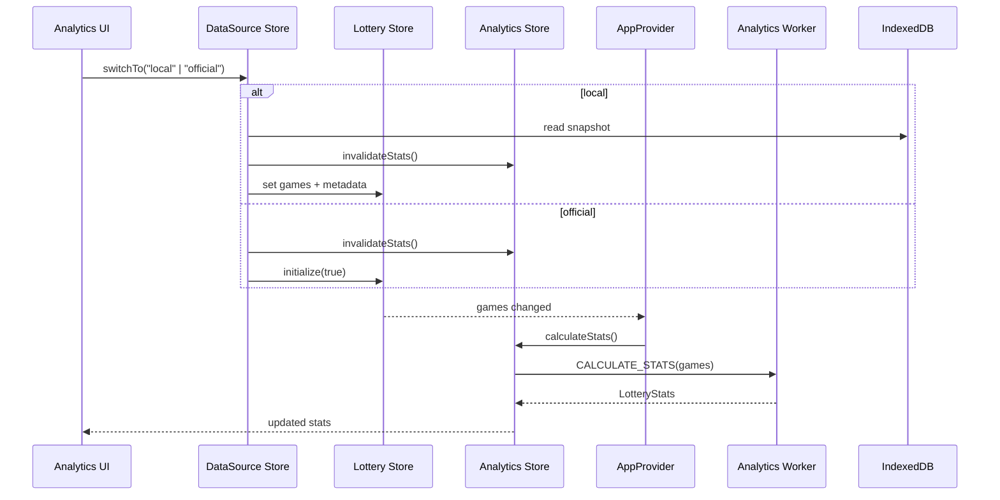

# Sortudo Architecture and System Design

Este documento descreve a arquitetura atual do Sortudo, os fluxos de runtime, as práticas de engenharia adotadas e os pontos de atenção para evolução.

## 1. Objetivo e Escopo

O Sortudo é uma aplicação React orientada a funcionalidades (feature-first), com foco em:

- visualização analítica da Mega-Sena;
- geração de combinações e busca histórica;
- responsividade da UI mesmo com cálculos intensivos.

Escopo deste documento:

- arquitetura lógica do frontend;
- system design do runtime no navegador;
- governança de código e qualidade;
- lacunas conhecidas e próximas melhorias.

## 2. Visão Arquitetural

### 2.1 Camadas Principais

- `src/app/`: bootstrap global, roteamento e composição da aplicação.
- `src/features/`: módulos de negócio por domínio (analytics, search, generator, home, about).
- `src/shared/`: componentes e utilitários realmente compartilhados entre features.
- `src/store/`: estado global e coordenação de dados (Zustand).
- `src/workers/`: processamento assíncrono em background (analytics, search, parser).
- `src/services/`: acesso a dados externos/estáticos.
- `src/lib/`: bibliotecas internas transversais (schemas, tipos, persistência, helpers).

### 2.2 Diagrama Estrutural

## 3. System Design (Runtime)

### 3.1 Boot e Hidratação

- `AppProvider` inicializa `Lottery Store`.
- Mudanças em `games` disparam recálculo no `Analytics Store`.
- `Generator Store` recebe serviços injetados (verificação e provider de stats).
- `DataSource Store` determina se há snapshot local disponível.

### 3.2 Consistência de Estatísticas

- `Analytics Store` mantém `statsSignature` para evitar recomputação indevida.
- Ao trocar fonte de dados (`official`/`local`), a assinatura é invalidada.
- Se a assinatura atual divergir da assinatura do dataset carregado, há recálculo.
- Detecção de schema legado também foi centralizada no store (não na UI).

### 3.3 Fluxo de Troca de Fonte de Dados

## 4. Worker Design

O projeto adota um protocolo padronizado para comunicação com workers:

- `FeatureWorkerClient`: cliente genérico com timeout e correlação por request id.
- `worker-protocol`: envelope de request/response e tratamento padronizado de erro.
- validação com Zod em comandos e payloads de resposta.
- engines especializados por domínio (`analytics`, `search`, `parser`).

Benefícios:

- evita bloqueio da thread principal;
- mantém contratos tipados entre UI e processamento pesado;
- reduz acoplamento entre camada de apresentação e cálculo.

## 5. Data Model e Fronteiras de Validação

- Dados oficiais: lidos de `public/data.json` via `Lottery Service`.
- Dados locais: persistidos em IndexedDB (`lotteryIdb`).
- Validação de entrada e borda: schemas Zod em serviço e workers.
- Regras de compatibilidade (schema legado): centralizadas no estado de analytics.

## 6. Code Practices

### 6.1 Organização e Limites

- Manter lógica de domínio dentro da feature correspondente.
- Promover para `shared` e `lib` apenas o que é reutilizável entre múltiplas features.
- Evitar lógica de migração/normalização na camada de UI.

### 6.2 Estado e Reatividade

- Stores são a fonte de verdade para dados globais.
- Componentes consomem selectors e hooks; não orquestram consistência global.
- Recalcular estatísticas por assinatura de dataset, não por heurística visual.

### 6.3 Componentização e Manutenibilidade

- Preferir extrações incrementais de componentes/hook em arquivos próprios.
- Evitar monólitos extensos em telas principais.
- Manter contratos de props explícitos e estáveis.

### 6.4 Qualidade

- tipagem estrita (TypeScript);
- validação de contrato com Zod;
- lint e formatação automáticos;
- testes por camada de responsabilidade.

## 7. Estratégia de Testes

- Unit: lógica matemática, utilitários e protocolo de worker.
- Integration: orquestração de stores e fluxos entre módulos.
- Regression: cenários historicamente sensíveis (normalização e analytics).
- E2E: jornadas essenciais do usuário (geração, busca e dashboard).

## 8. Operação e Runbook

Comandos principais:

- `bun run dev` — desenvolvimento local.
- `bun run typecheck` — validação de tipos.
- `bun run lint` — lint estático.
- `bun run test:unit` — suíte unit/integration/regression.
- `bun run test:e2e` — testes E2E.
- `bun run codebase:smells` — checks agregados de qualidade.

## 9. Segurança e Performance

- Offloading de cálculos pesados para workers.
- Validação estrita de payloads para evitar corrupção de estado.
- Persistência local isolada por chave e store IDB.
- Dependências e vulnerabilidades verificadas por pipeline de qualidade.

## 10. Lacunas Conhecidas e Próximos Passos

- modularizar totalmente `Analytics` para reduzir nloc e complexidade;
- expandir cobertura E2E de fluxos de troca de fonte e navegação de capítulos;
- otimizar payload de busca/analytics para reduzir transferências redundantes;
- manter README e docs sincronizados com a arquitetura vigente.

## 11. Referências

- `src/app/provider.tsx`
- `src/store/analytics.ts`
- `src/store/data.ts`
- `src/store/lottery.ts`
- `src/workers/worker-client.ts`
- `src/workers/worker-protocol.ts`
- `src/services/lottery.ts`
